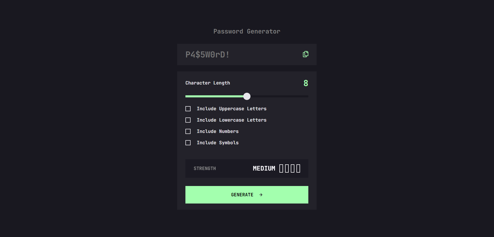

# Frontend Mentor - Password generator app solution

This is a solution to the [Password generator app challenge on Frontend Mentor](https://www.frontendmentor.io/challenges/password-generator-app-Mr8CLycqjh). Frontend Mentor challenges help you improve your coding skills by building realistic projects. 

## Table of contents

- [Overview](#overview)
  - [The challenge](#the-challenge)
  - [Screenshot](#screenshot)
  - [Links](#links)
- [My process](#my-process)
  - [Built with](#built-with)
  - [What I learned](#what-i-learned)
  - [Useful resources](#useful-resources)
- [Author](#author)


## Overview

### The challenge

Users should be able to:

- Generate a password based on the selected inclusion options
- Copy the generated password to the computer's clipboard
- See a strength rating for their generated password
- View the optimal layout for the interface depending on their device's screen size
- See hover and focus states for all interactive elements on the page

### Screenshot

- Main: 

- Medium-strength: 

- Copying-password: 

### Links

- Solution URL: [https://github.com/Jo-cloud85/password-generator-app.git](https://github.com/Jo-cloud85/password-generator-app.git)
- Live Site URL: [https://jo-cloud85.github.io/password-generator-app/](https://jo-cloud85.github.io/password-generator-app/)


## My process

### Built with

- Semantic HTML5 markup
- CSS custom properties
- Flexbox
- CSS Grid
- Mobile-first workflow
- [noUiSlider](https://refreshless.com/nouislider/) - JS range slider
- [wNumb.js](https://refreshless.com/wnumb/) - JS formatting library
- [Styled Components](https://styled-components.com/) - For styles

### What I learned

I learnt about working with new libraries like noUiSlider and wNumb, and how to copy text using:

```
navigator.clipboard.writetext(password.value);
```

### Useful resources

- [How TO - Copy Text to Clipboard](https://www.w3schools.com/howto/howto_js_copy_clipboard.asp) - This helped me with the copying function for this challenge.

- [noUiSlider](https://refreshless.com/nouislider/) - Previously, I was customizing a slider manually. I got to learn about this slider JS library that allows developers to highly customize sliders according to their needs.

- [wNumb](https://refreshless.com/wnumb/) - I have used this library in conjunction with noUiSlider to format the range numbers into integers. By default, noUiSlider's range output always comes in 2 decimal places.


## Author

- Frontend Mentor - [@Jo-cloud85](https://www.frontendmentor.io/profile/Jo-cloud85)
